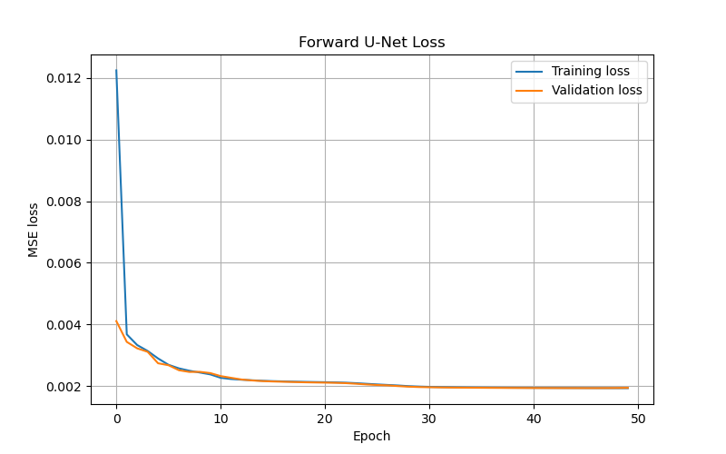
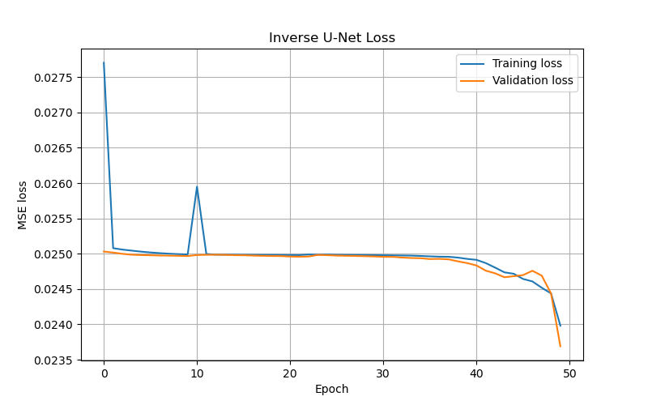
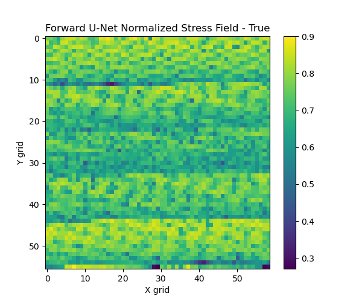
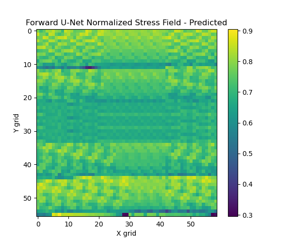
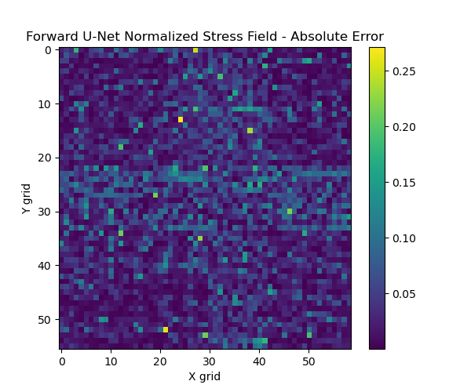
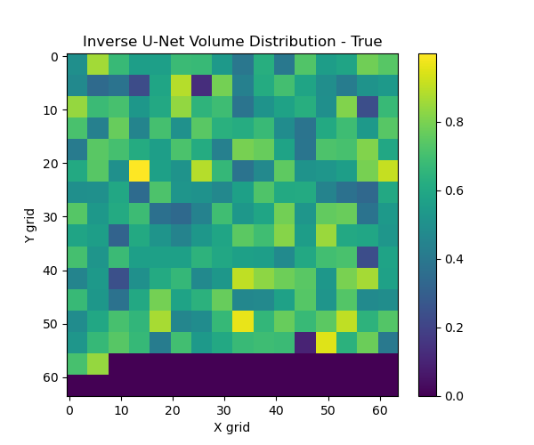
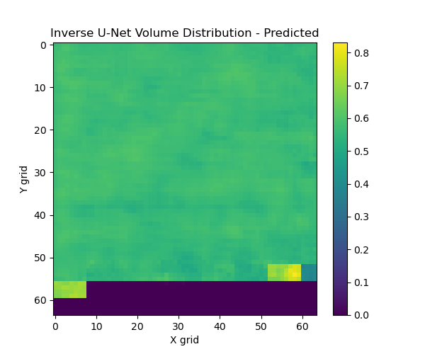
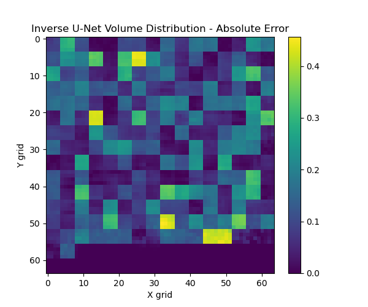

# U-Net Based Stress Field Prediction for Cantilever Beam Structures

This project uses deep learning to predict normalized von Mises stress fields for cantilever beam lattice structures from strut-thickness / volume fraction distributions. It also explores the inverse problem of reconstructing volume fraction distributions from stress fields.

## Project Overview

The cantilever beam structure is made of centered rectangular unit cells. Each strut has a different thickness value, and the objective is to understand how the thickness distribution affects the resulting von Mises stress field.

This repository implements two U-Net models:

- **Forward U-Net:** Predicts the normalized von Mises stress field from a volume fraction / strut-thickness distribution.
- **Inverse U-Net:** Reconstructs the volume fraction distribution from a normalized stress field.

## Dataset Description

The project dataset contains:

- `output.xlsx`: Strut-thickness / volume fraction data for different material distributions.
- `stress/`: Text files containing von Mises stress values and deformed coordinates.
- `cord.txt`: Coordinates of the undeformed structure.

In the implemented pipeline:

- Each input volume distribution has **226 thickness values**.
- Volume vectors are padded and converted into **64 x 64 image-like arrays**.
- Each stress field contains **3304 stress values**.
- Stress vectors are reshaped and padded into **64 x 64 stress-field arrays**.

## Note on Dataset

The dataset is not included in this repository because it is too large. This repository contains the implementation code, methodology, and result visualizations.

## Methodology

1. Loaded volume fraction data from `output.xlsx`.
2. Loaded von Mises stress values from the `stress/` folder.
3. Converted volume and stress vectors into image-like 2D arrays.
4. Applied min-max normalization to volume distributions.
5. Applied log transformation and normalization to stress fields.
6. Split the data into training, validation, and testing sets.
7. Trained a Forward U-Net for stress-field prediction.
8. Trained an Inverse U-Net for volume-distribution reconstruction.
9. Evaluated results using MSE, MAE, training/validation loss curves, and absolute error plots.

## Model Architecture

The U-Net architecture includes:

- Encoder blocks using `Conv2D` and `MaxPooling2D`
- Bottleneck convolution layers
- Decoder blocks using `Conv2DTranspose`
- Skip connections between encoder and decoder layers
- Final `Conv2D` layer with sigmoid activation

Both the Forward U-Net and Inverse U-Net use the same architecture.

## Tools and Libraries

- Python
- TensorFlow / Keras
- NumPy
- Pandas
- Matplotlib
- Scikit-learn

## Results and Visualizations

### Forward U-Net Loss



### Inverse U-Net Loss



### Forward U-Net: True Stress Field



### Forward U-Net: Predicted Stress Field



### Forward U-Net: Absolute Error



### Inverse U-Net: True Volume Distribution



### Inverse U-Net: Predicted Volume Distribution



### Inverse U-Net: Absolute Error



## Key Observations

- The **Forward U-Net** showed stable convergence and learned the mapping from volume distribution to normalized von Mises stress field.
- The **Inverse U-Net** was more challenging because multiple volume distributions can produce similar stress-field patterns.
- The predicted inverse volume distribution was smoother than the true distribution, highlighting the higher complexity of inverse design problems.
- Absolute error plots were used to visually compare true and predicted fields.

## Repository Structure

```text
U-Net-Based-Stress-Field-Prediction-for-Cantilever-Beam-Structures/
│
├── Project.py
├── README.md
├── 1.png
├── 2.png
├── 3.png
├── 4.png
├── 5.png
├── 6.png
├── 7.png
└── 8.png
```

## How to Run

1. Clone this repository:

```bash
git clone https://github.com/prakhargarg0106/U-Net-Based-Stress-Field-Prediction-for-Cantilever-Beam-Structures.git
```

2. Move into the project folder:

```bash
cd U-Net-Based-Stress-Field-Prediction-for-Cantilever-Beam-Structures
```

3. Install the required libraries:

```bash
pip install numpy pandas matplotlib scikit-learn tensorflow openpyxl
```

4. Place the dataset folder or zip file in the same directory as `Project.py`:

```text
prob1_data/
```

or

```text
prob1_data(1).zip
```

5. Run the script:

```bash
python Project.py
```

## Project Status

Completed as part of a Deep Learning for Physical Systems project.

## Author

**Prakhar Garg**  
B.Tech Mechanical Engineering  
Indian Institute of Technology Ropar
